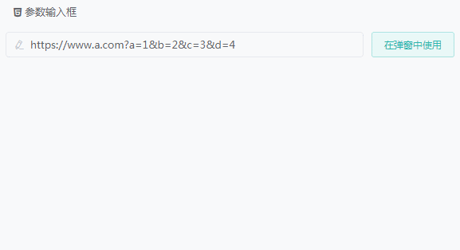

# Element UI 地址参数辅助输入框



## Install

``` shell
npm install element-params-input -S
```

## Demo

[Online](http://123.207.117.50/#/params)

## Quick Start

``` javascript
// main.js
import Vue from "vue"; // vue
import element from "element-ui"; // elementUI

import elementParamsInput from "element-params-input";

// elementUI
Vue.use(element, { size: "small" });

Vue.use(elementParamsInput);
```

``` html
 <!-- template -->
<i-params v-model="url" placeholder="占位" absolute prefixicon="el-icon-edit"></i-params>
```

## Props

1. `v-model`: 双向绑定，与el-input一致
2. `placeholder`: 占位，与el-input表现一致
3. `absolute`: 参数输入框的定位，未指定将是流定位
4. `prefixicon`: 输入框图标，font-class


## License

[MIT](./LICENSE)


